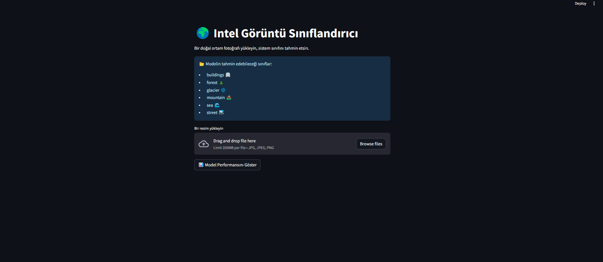
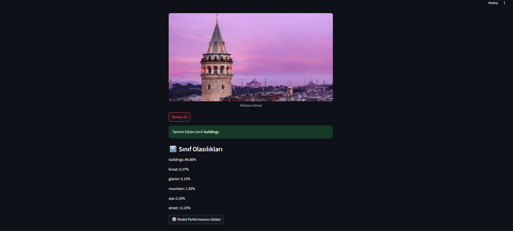

# 🧠 Yapay Zeka Destekli Doğal Ortam Görüntü Sınıflandırıcı

Bu projede doğal ortam fotoğraflarını tanıyan bir yapay zeka sistemi geliştirilmiştir. Kullanıcı bilgisayarından bir görsel yüklediğinde sistem, bu görseli işler, hangi sınıfa ait olduğunu % olasılıklarla tahmin eder ve sonucu kullanıcıya sade bir arayüzle sunar.

---

## 🎯 Proje Amacı

- Görsel verileri PyTorch ile eğitilen modelle sınıflandırmak  
- Kullanıcıya yalnızca tahmin edilen sınıfı değil, **tüm sınıflara ait tahmin yüzdelerini** göstermek  
- Modelin başarımını metriklerle (accuracy, precision, recall) değerlendirmek  
- Basit ve erişilebilir bir arayüz sunmak

---

## 📂 Tanınabilen Sınıflar

Model, Intel Image Classification veri setiyle eğitilmiş olup şu 6 sınıfı tanımaktadır:

| Sınıf      | Açıklama              |
|------------|------------------------|
| buildings  | Binalar, yapılar       |
| forest     | Ormanlık alanlar       |
| glacier ❄   | Buzullar ve kar        |
| mountain ⛰  | Dağlık bölgeler        |
| sea        | Deniz manzaraları      |
| street 🛣    | Şehir sokakları        |

---

## 📈 Model Performansı

Test verisi üzerinde elde edilen başarı metrikleri:

| Metrik     | Değer   |
|------------|---------|
| Accuracy   | `0.8942` |
| Precision  | `0.8801` |
| Recall     | `0.8743` |

### 📋 Sınıf Bazlı Rapor (Özet)

```
              precision    recall  f1-score   support

   buildings       0.85      0.86      0.85       240
      forest       0.91      0.92      0.91       240
     glacier       0.88      0.84      0.86       240
    mountain       0.90      0.89      0.89       240
         sea       0.87      0.87      0.87       240
      street       0.86      0.87      0.86       240
```

---

## 🖥️ Uygulama Arayüzü Özellikleri

- Görsel yükleme alanı
- "Tahmin Et" butonu
- En yüksek olasılıkla tahmin edilen sınıf
- **Tüm sınıflar için yüzdelik olasılık listesi**
- “📊 Model Performansını Göster” kutucuğu ile modelin genel başarı metriği

---

## 🚀 Uygulama Kurulumu ve Kullanımı

### 1. Gereken kütüphaneleri yükleyin:
```bash
pip install torch torchvision streamlit pillow scikit-learn
```

### 2. Modeli eğitmek için (isteğe bağlı):
```bash
python train.py
```

### 3. Uygulamayı çalıştırmak için:
```bash
streamlit run app.py
```

---

## 🖼️ Arayüz Görseli



---

---

## 🖼️ Sonuç Görseli



---

## 🧱 Kullanılan Teknolojiler

- Python
- PyTorch
- Streamlit
- scikit-learn
- Intel Image Classification Dataset

---

## 📁 Proje Yapısı

```
yapay_zeka_proje/
├── app.py
├── model.py
├── train.py
├── utils/
│   └── preprocessing.py
├── models/
│   └── model.pth
├── dataset/
│   └── seg_train / seg_test
├── screenshot
│   └── arayuz.png
│   └── sonuc.png
│   └── sonuc2.png
├── demoVideosu 
└── README.md
```

---

## 👤 Geliştirici

**Muhammet Aksu**  
